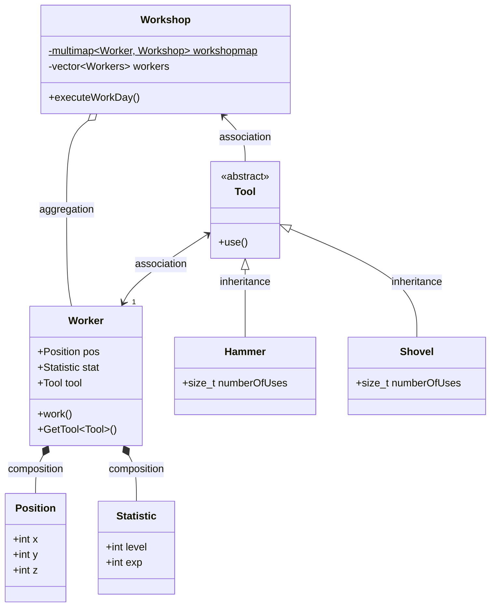

I'll try to update this with my study notes.

I made this python CLI that may help people doing the project.

### CLI Guide

#### Features

- A cli for you to streamline the piscine boilerplate, Makefiles and default files.
- A set of suggested extensions.
- VSCode configurations to kickstart your formatter and linter customizations.

```console
# Download the attached asset
wget https://github.com/VLN37/Piscine-Object/releases/download/v1.0.1/turbo_piscine.tar.gz
# extract the files
tar -xzf turbo_piscine.tar.gz
# required permissions
chmod a+x cli.py
#  create your first module with this example
./cli.py create encapsulation ex00
```

### UML


