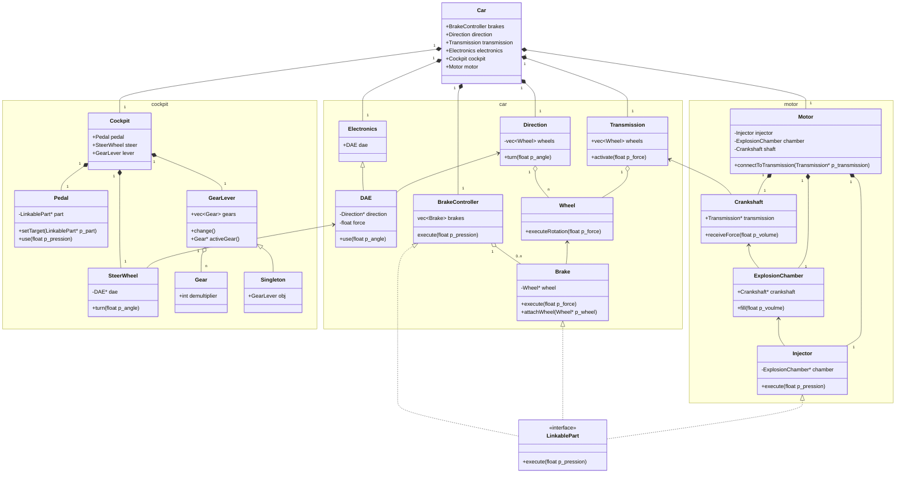

```mermaid

classDiagram
direction BT

%% car

BrakeController "1" --* "1" Car
Direction "1" --* "1" Car
Transmission "1" --* "1" Car
Electronics "1" --* "1" Car
Cockpit "1" --* "1" Car
Motor "1" --* "1" Car

Wheel "n" --o "1" Transmission
Brake --> Wheel
Wheel "n" --o "1" Direction
Brake "0..n" --o  "1" BrakeController
DAE --> Direction
SteerWheel --> DAE
DAE --|> Electronics


%% motor
Injector "1" --* "1" Motor
ExplosionChamber "1" --* "1" Motor
Crankshaft "1" --* "1" Motor
ExplosionChamber --> Crankshaft
Injector --> ExplosionChamber
%% Motor .. Transmission

%% cockpit
Pedal "1" --* "1" Cockpit
GearLever "1" --* "1" Cockpit
SteerWheel "1" --* "1" Cockpit
Gear "n" --o "1" GearLever
Singleton --|> GearLever
Crankshaft --> Transmission
%% Pedal --> Injector
%% Pedal --> Brake
%% Pedal --> BrakeController


LinkablePart  ..|> Injector
LinkablePart ..|> Brake
LinkablePart ..|> BrakeController

class Car {
    +BrakeController brakes
    +Direction direction
    +Transmission transmission
    +Electronics electronics
    +Cockpit cockpit
    +Motor motor
}

namespace cockpit {
    class Cockpit {
        +Pedal pedal
        +SteerWheel steer
        +GearLever lever
    }

    class Gear {
        +int demultiplier
    }

    class Singleton~GearLever~ {
        +GearLever obj
    }

    class GearLever {
        +vec~Gear~ gears
        +change()
        +Gear* activeGear()
    }

    class Pedal {
        -LinkablePart* part

        +setTarget(LinkablePart* p_part)
        +use(float p_pression)
    }

    class SteerWheel {
        -DAE* dae

        +turn(float p_angle)
    }
}

namespace car {

    class Wheel {
        +executeRotation(float p_force)
    }

    class Transmission {
        +vec~Wheel~ wheels
        +activate(float p_force)
    }


    class Direction {
        -vec~Wheel~ wheels

        +turn(float p_angle)
    }

    class DAE {
        -Direction* direction
        -float force

        +use(float p_angle)
    }

    class Brake {
        -Wheel* wheel

        +execute(float p_force)
        +attachWheel(Wheel* p_wheel)
    }

    class BrakeController {
        vec~Brake~ brakes

        execute(float p_pression)
    }

    class Electronics {
        +DAE dae
    }
}

namespace motor {
    class Crankshaft {
        +Transmission* transmission

        +receiveForce(float p_volume)
    }

    class ExplosionChamber {
        +Crankshaft* crankshaft

        +fill(float p_voulme)
    }


    class Injector {
        -ExplosionChamber* chamber

        +execute(float p_pression)
    }

    class Motor {
        -Injector injector
        -ExplosionChamber chamber
        -Crankshaft shaft

        +connectToTransmission(Transmission* p_transmission)
    }
}

    class LinkablePart {
        <<interface>>
        +execute(float p_pression)
    }

```
