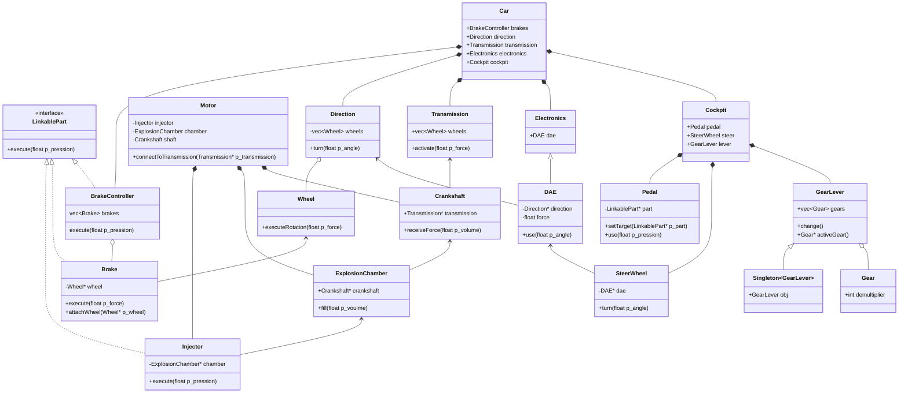

```mermaid

classDiagram

class LinkablePart {
    <<interface>>
    +execute(float p_pression)
}

class Wheel {
    +executeRotation(float p_force)
}

class Gear {
    +int demultiplier
}

class Singleton~GearLever~ {
    +GearLever obj
}


Singleton --|> GearLever
Gear --o GearLever
class GearLever {
    +vec~Gear~ gears
    +change()
    +Gear* activeGear()
}


%% Wheel --o Transmission
class Transmission {
    +vec~Wheel~ wheels
    +activate(float p_force)
}

Crankshaft --> Transmission
class Crankshaft {
    +Transmission* transmission

    +receiveForce(float p_volume)
}

ExplosionChamber --> Crankshaft
class ExplosionChamber {
    +Crankshaft* crankshaft

    +fill(float p_voulme)
}

Injector  ..|>  LinkablePart
Brake ..|>  LinkablePart
BrakeController ..|>  LinkablePart
Injector --> ExplosionChamber
class Injector {
    -ExplosionChamber* chamber

    +execute(float p_pression)
}

Injector --* Motor
ExplosionChamber --* Motor
Crankshaft --* Motor
class Motor {
    -Injector injector
    -ExplosionChamber chamber
    -Crankshaft shaft

    +connectToTransmission(Transmission* p_transmission)
}

class Pedal {
    -LinkablePart* part

    +setTarget(LinkablePart* p_part)
    +use(float p_pression)
}

Wheel --o Direction
class Direction {
    -vec~Wheel~ wheels

    +turn(float p_angle)
}

DAE --> Direction
class DAE {
    -Direction* direction
    -float force

    +use(float p_angle)
}

SteerWheel --> DAE
class SteerWheel {
    -DAE* dae

    +turn(float p_angle)
}

Brake --> Wheel
class Brake {
    -Wheel* wheel

    +execute(float p_force)
    +attachWheel(Wheel* p_wheel)
}

Brake --o BrakeController
class BrakeController {
    vec~Brake~ brakes

    execute(float p_pression)
}

DAE --|> Electronics
class Electronics {
    +DAE dae
}

Pedal --* Cockpit
SteerWheel --* Cockpit
GearLever --* Cockpit
class Cockpit {
    +Pedal pedal
    +SteerWheel steer
    +GearLever lever
}

BrakeController --* Car
Direction --* Car
Transmission --* Car
Electronics --* Car
Cockpit --* Car
class Car {
    +BrakeController brakes
    +Direction direction
    +Transmission transmission
    +Electronics electronics
    +Cockpit cockpit
}

direction BT

```
